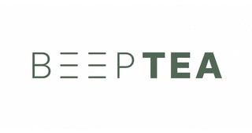

🌍 *[Read this in English](README.md) | [Leer en Español](README_ES.md)*

# BeepTEA

**BeepTEA** es un comunicador inteligente en formato reloj (basado en la placa LilyGo T-Display-S3) diseñado específicamente para ayudar a niños y personas con Trastorno del Espectro Autista (TEA) u otras necesidades cognitivas. 

Su función principal es ofrecer rutinas visuales mediante pictogramas y un sistema de avisos por vibración sin necesidad de depender de una conexión constante a internet, mejorando su autonomía y reduciendo la ansiedad.

---

## 🎯 Características Principales
* 📵 **Independencia Real:** Funciona 100% offline tras su configuración. Mantiene la hora internamente (RTC).
* 🖼️ **Rutinas Visuales:** Muestra pictogramas personalizados para guiar al usuario en sus tareas del día a día (comer, lavarse las manos, dormir...).
* 📳 **Alertas Amigables:** El reloj vibra y emite suaves tonos cuando llega la hora de una rutina nueva, captando la atención sin asustar.
* 📶 **Conectividad a Demanda:** El propio reloj genera un portal cautivo (Red Wi-Fi directa) para configurarlo inicialmente o se conecta vía **Bluetooth (BLE)** para sincronizar rutinas con la App móvil.

## 📦 Estructura del Proyecto

Este repositorio contiene todo lo necesario para montar y modificar el sistema al completo:

1. `/firmware`: El código fuente C++ para el microcontrolador ESP32-S3. Preparado para compilarse con **PlatformIO**.
2. `/mobile-app`: El código fuente de la aplicación móvil compañera (**BeepTEA Manager**) desarrollada con **Capacitor** y HTML/JS puro. Permite subir pictogramas y programar las alarmas/rutinas de forma sencilla por Bluetooth.
3. `/BOM.txt`: Lista de materiales y componentes utilizados en el proyecto.

## 🛠️ Hardware Necesario

El cerebro del proyecto es una **LilyGo T-Display-S3**, un potentísimo ESP32-S3 con pantalla IPS a color incorporada. A esta placa le hemos añadido:

* **Motor de Vibración (Háptico):** Conectado al PIN 43.
* **Buzzer (Zumbador):** Conectado al PIN 44.
* **Botón Físico Extra:** (Aparte de los botones internos en los PINES 0 y 14 de la placa).
* **Batería LiPo:** Con monitorización inteligente de voltaje (se conecta al PIN 4 para medir batería).

## 🚀 Guía de Instalación (Firmware)

1. Instala [Visual Studio Code](https://code.visualstudio.com/) y la extensión [PlatformIO](https://platformio.org/).
2. Abre la carpeta `/firmware` en VS Code.
3. Conecta tu placa LilyGo T-Display-S3 por USB.
4. Primero, compila y sube el sistema de archivos (LittleFS) usando la opción **`Upload File System Image`** en PlatformIO (esto subirá el portal cautivo y el logo).
5. Segundo, compila y sube el código fuente con la opción **`Upload`**.

## 📱 Guía de Compilación (App Móvil)

Para compilar la aplicación móvil, necesitarás [Node.js](https://nodejs.org/) y Android Studio.

1. Abre la carpeta `/mobile-app` en tu terminal.
2. Instala las dependencias: `npm install`
3. Sincroniza el código web con el proyecto nativo de Android: `npx cap sync android`
4. Ábrelo en Android Studio para generar tu APK: `npx cap open android`

## 🤝 Créditos y Colaboración

Proyecto creado con dedicación para facilitar la vida y mejorar la autonomía de personas con TEA. ¡Siéntete libre de clonar, mejorar o proponer nuevas funcionalidades abriendo una *Pull Request*!
